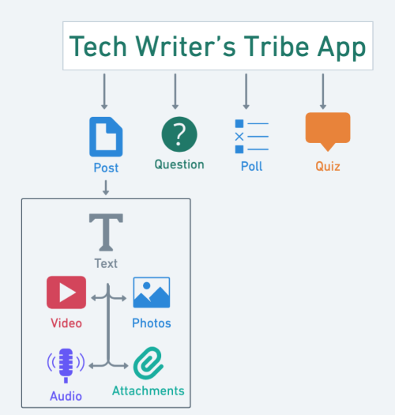

## Creating a Post: Quick Start Guide

**Table of Contents**

- [Overview](#overview)
- [Prerequisites](#prerequisites)
- [Creating a Post](#creating-a-post)
  - [Create a Text-only Post](#create-a-text-only-post)
  - [Share an Image](#share-an-image)
  - [Share a Video](#share-a-video)
  - [Post Audio](#post-audio)
  - [Share a File](#share-a-file)
  - [Add a Question](#add-a-question)
  - [Create a Poll](#create-a-poll)
  - [Create a Quiz](#create-a-quiz)
- [Frequently Asked Questions](#frequently-asked-questions)

# Overview

Tech Writer's Tribe (TWT) app is a social networking platform that allows technical writers to share posts, upload and download resources, ask questions, and engage in knowledge-sharing activities. This quick start guide describes how to create a post on Tech Writer’s Tribe (TWT) Android mobile app.  

The following figure shows the types of posts available in the TWT mobile app.

# Prerequisites

To create and share posts in the TWT mobile app, complete the following steps:

1. **Install the Tech Writer's Tribe (TWT) App**  
    Download the app from Google Play  [Tech Writer's Tribe - Apps on Google Play](https://play.google.com/store/apps/details?id=com.rpy.techwrarhpin)
2. **Create an Account**  
    Sign up with your email ID or mobile number to access all features.
3. **Set Up Your Profile (Recommended)**  
    Add your name, email, location, interested topics, social media urls, and profile picture to enhance engagement with your posts.

# Creating a Post

The Tech Writer’s Tribe (TWT) app allows you to create and share posts with the technical writer community. You can create the following types of posts in the TWT app.

- Text-only Post
- Share an Image
- Share a Video
- Post Audio
- Share a File
- Add a Question
- Create a Poll
- Create a Quiz

## Create a Text-only Post

You can create only text as your post and share with the technical writer community.

To create,

1. On your mobile, launch the TWT app.
2. On the home page, at the bottom-right, Select **(+)**.
3. In the list, select **Post**.
4. On the **Share a Post** screen, enter a text to post.
5. On the top-right corner, select **Add Tag**.
6. In the tag list, select the desired tag.  
   The TWT app attaches the selected tag to your post.
7. On the top-right corner, select **POST**.

The text-only post is created.

## Share an Image

You can share an image as your post with the technical writer community.

To share an image,

1. On your mobile, launch the TWT app.
2. On the home page, at the bottom-right, Select **(+)**.
3. In the list, select **Post**.
4. On the **Share a Post** screen, select **Photos**.
5. In your mobile gallery, select single or multiple images.
6. Select **Add**.  
    The TWT app adds the selected image to your post.
7. (Optional)On the **Share a Post** screen, enter a text to post.
8. On the top-right corner, select **Add Tag.**
9. In the tag list, select the desired tag.  
   The TWT app attaches the selected tag to your post.
11. On the top-right corner, select **POST**.

An image post is created.

## Share a Video

You can share a video as your post with the technical writer community.

To share a video,

1. On your mobile, launch the TWT app.
2. On the home page, at the bottom-right, Select **(+)**.
3. In the list, select **Post**.
4. On the **Share a Post** screen, select **Videos**.
5. In your mobile gallery, select a video.  
    The TWT app adds the selected video to your post.
6. (Optional)On the **Share a Post** screen, enter a text to post.
7. On the top-right corner, select **Add Tag.**
8. In the tag list, select the desired tag.  
    The TWT app attaches the selected tag to your post.
9. On the top-right corner, select **POST**.

A video post is created.

## Post Audio

You can create an audio as a post and share with the technical writer community.

To post audio,

1. On your mobile, launch the TWT app.
2. On the home page, at the bottom-right, Select **(+)**.
3. In the list, select **Post**.
4. On the **Share a Post** screen, select **Audio**.
5. Allow the TWT app to record audio.
6. Record your audio.
7. Select STOP RECORDING.  
    The TWT app adds the audio file to your post.
8. (Optional)On the **Share a Post** screen, enter a text to post.
9. On the top-right corner, select **Add Tag.**
10. In the tag list, select the desired tag.  
    The TWT app attaches the selected tag to your post.
11. On the top-right corner, select **POST**.

An audio post is created.

## Share a File

You can add audio files, video files, and other documents to your posts and share them with the technical writer community.

To share a file,

1. On your mobile, launch the TWT app.
2. On the home page, at the bottom-right, Select **(+)**.
3. In the list, select **Post**.
4. On the **Share a Post** screen, select **Documents**.
5. Select the file to upload from the available options.  
    The TWT app adds the selected file to your post.
6. (Optional)On the **Share a Post** screen, enter a text to post.
7. On the top-right corner, select **Add Tag.**
8. In the tag list, select the desired tag.  
    The TWT app attaches the selected tag to your post.
9. On the top-right corner, select **POST**.

A post is created with the selected file.

## Add a Question

You can ask a question to the technical writer community.

To add a question,

1. On your mobile, launch the TWT app.
2. On the home page, at the bottom-right, Select **(+)**.
3. In the list, select **Question**.  
    The TWT app displays the **Share a Question** screen.
4. In the **Question** box, enter a question.
5. On the top-right corner, select **Add Tag.**
6. In the tag list, select the desired tag.  
    The TWT app attaches the selected tag to your question.
7. Select **Post Question**.

The question is created. Now, you can view the responses when others answer your question.

## Create a Poll

You can create a poll to seek views about a topic with other users.

To create,

1. On your mobile, launch the TWT app.
2. On the home page, at the bottom-right, Select **(+)**.
3. In the list, select **Poll**.  
    The TWT app displays the **Share a Poll** screen.
4. In the **Question** box, enter a question.
5. In the **Options** box, enter the options.  
    **Note**: To add more than two options, select **\+ Add more**.
6. In the **Expires In** box, select expiry days from the drop-down list.
7. On the top-right corner, select **Add Tag.**
8. In the tag list, select the desired tag.  
    The TWT app attaches the selected tag to your poll.
9. Select **Post Poll**.

The poll is created. You can view the responses when others participate in your poll.

## Create a Quiz

You can create a post as a quiz to test the knowledge of other users.

To create,

1. On your mobile, launch the TWT app.
2. On the home page, at the bottom-right, Select **(+)**.
3. In the list, select **Quiz**.  
    The TWT app displays the **Share a Quiz** screen.
4. In the **Question** box, enter a question.
5. In the **Options** box, enter the options.  
    **Note**: To add more than two options, select **\+ Add more**.
6. In the **Answer** box, select the correct answer from the drop-down list.
7. In the **Expires In** box, select expiry days from the drop-down list.
8. On the top-right corner, select **Add Tag.**
9. In the tag list, select the desired tag.  
    The TWT app attaches the selected tag to your quiz.
10. Select **Post Quiz**.

The Quiz is created. Now, you can view the responses when others answer your quiz.

# Frequently Asked Questions

- **Can I edit or remove a tag after posting?**  
    Currently, you cannot edit tags after posting. However, you can delete the post and create a new one with the correct tags.  

- **Is there a limit to the number of tags I can use per post?**  
    Yes, you can attach up to 3 tags per post.  

- **Can I create custom tags?**  
    At the moment, you can only select from predefined tags.

[def]: #
[def2]: #
